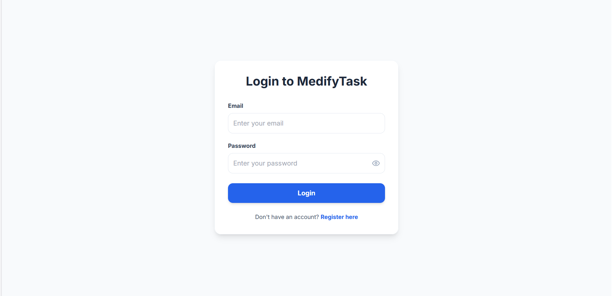
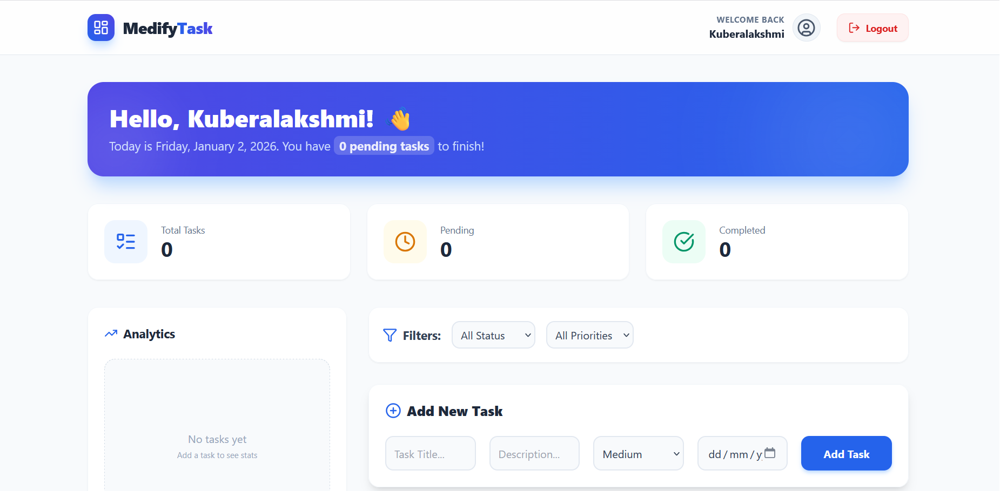
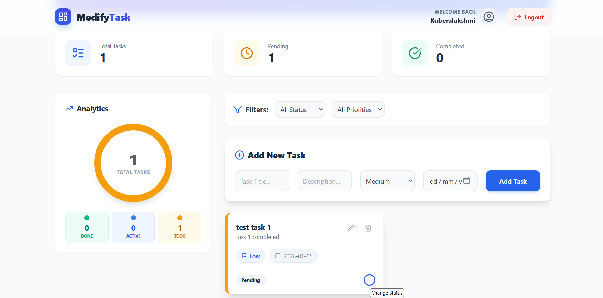

# 🚀 MedifyTask - Smart Task Management App

**MedifyTask** is a modern, responsive task management application.
---

## ✨ Key Features

* **🔐 User Authentication:** Secure Login and Registration page.
* **📊 Interactive Dashboard:** Visual analytics of task status (Pending, Completed).
* **✅ Task Management:** Easy to Add, Edit, and Delete tasks.
* **📱 Fully Responsive:** Works perfectly on Mobile, Tablet, and Desktop.
* **🎨 Modern UI:** Built with Tailwind CSS for a clean look.

---

🔗 **Live Frontend:** [Click Here](https://medify-task-app.vercel.app)
🔗 **Live Backend:** [Click Here](https://medify-api.onrender.com)

---

👤 Author

Kuberalakshmi K Final Year B.E. CSE (Data Science)

Annamalai University


## 📸 Screenshots

### 1. Login Page


### 2. Dashboard & Analytics


### 3. Add Task & Management


---
### 🎥 Live Demo

[▶️ Click Here to Watch Video Demo] https://drive.google.com/file/d/17mhICIaed7lgaIEbaWWVez6P8yhi5evI/view?usp=sharing

## 🛠️ Tech Stack used
* PERN Stack (Postgre SQL, Express, React, Node)
* Tailwind CSS
---

## 🚀 How to Run Locally

If you want to run this project on your local machine, follow these steps:

### 1. Clone the Repository
```bash
git clone [https://github.com/Kuberalakshmi-24/medify-task-app.git](https://github.com/Kuberalakshmi-24/medify-task-app.git)
cd medify-task-app

Install Dependencies (Client)

cd client
npm install
npm run dev

Setup Backend
(Make sure you have your backend .env file ready)

cd server
npm install
npm run server

Developed with ❤️ using React & MERN Stack.

